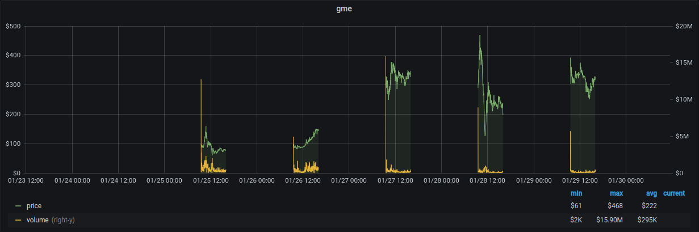
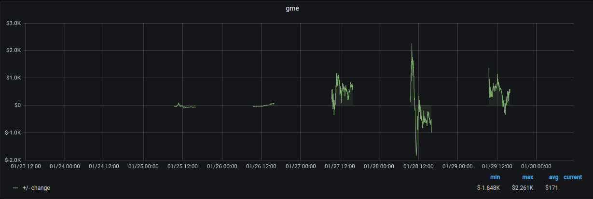

# grafana-portfolio
Track your holdings with Grafana

# Usage
+ Modify `portfolio.yml` with your accounts/lots
+ Run `docker-compose up -d`
+ Goto http://localhost:3000 (admin/admin)
+ ???
+ Profit

# Screenshots
+ Price & Volume

+ Your lots over time
